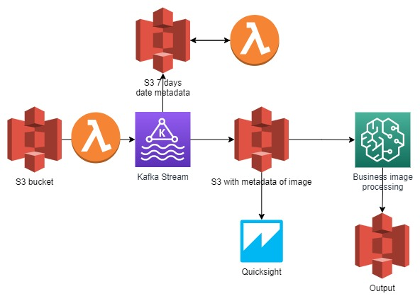

# Arquitectura procesamiento de imagenes

### Al equipo se le solicitó desarrollar una arquitectura para el procesamiento de imagen

La propuesta resultante está en amazon, la cual posee el siguiente diagrama

### Elementos y su función

* El primer bucket de S3 es donde se alojan las imagenes que son cargadas
* El lambda apenas recibe la imagen las envia al procesamiento en Kafka stream
* Kafka stream se encarga de decodificar la imagen a su componente vectorial y paralelo, crea un frame con el nombre del archivo y su metadata respectiva, datos como nombre, cliente, ubicación de la imagen en la arquitectura, resolución, modo de color(LAB, RGB, grayscale, entre otros)
* Las imagenes son almacenadas en el s3 arriba de Kafka (graficamente hablando), y este está sujeto a un lambda que lee la metadata creada y diariamente elimina las que están depositadas por más de 7 días
* En la grafica notamos que el proceso continua con un bucket a la derecha de Kafka stream, este almacena un dataset incremental con toda la metadata de las imagenes que han sido procesadas, para que pueda ser consumido por Quicksight
* Quicksight lee el dataset con la metadata y nos entrega distintas estadisticas de las imagenes procesadas, algunas como,  el número y el tipo de imágenes procesadas, y por cuales clientes
* A su vez, y desde el mismo bucket que consume quicksight, alimentamos a sagemaker, que es donde la empresa realiza todo su procesamiento de imagen, el cual realiza el deposito en el bucket de output para ser entregada al cliente

