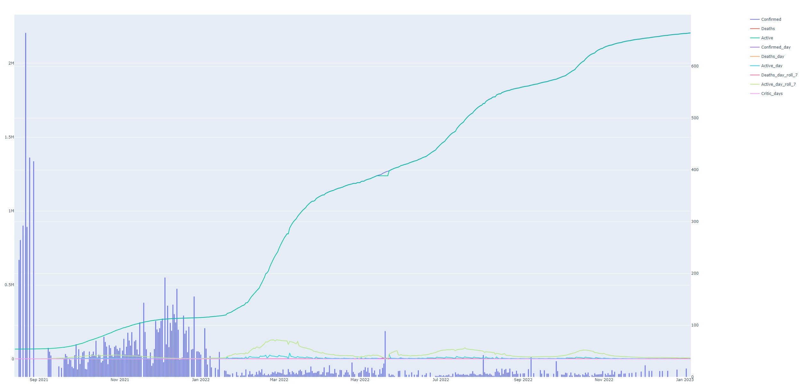
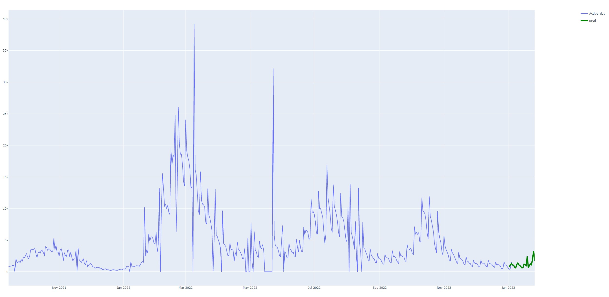

# Gráfico y API
### Al ver el buen desempeño del equipo en las ultimas labores, y por proactividad del mismo, deciden diseñar un tablero que muestre las estadisticas de los casos COVID-19 en Singapur, a traves de variadas investigaciones, utilizarán los datos públicos, y una de las tareas a abordar son la conexión y la realización de una grafica que muestre el progreso en el tiempo.

La dirección de la API a utilizar "https://api.covid19api.com/country/singapore", esta por naturaleza nos entrega [Confirmed, Deaths, Active, Date] como registros relevantes

[Reference to the graph, its better if you download it :wink: ](time_serie.html "download")

### Como sabemos, al equipo le gusta llegar a la milla extra, esto implica no quedar satisfecho con lo solicitado y creyó feacientemente que puede aportar mas valor.

Todo empezó con una lluvia de ideas de que indicadores, eventualmente, podrian aportar valor al entendimiento del virus, logrando crear las siguientes variables
* Confirmed_day : Cantidad de confirmados por día 
	* $\(confirmados[t] - confirmados[t-1])\$
* Deaths_day : Muertos por día 
	* $\(muertos[t] - muertos[t-1])\$
* Active_day : Activos por día 
	* $\(activos[t] - activos[t-1])\$
* Deaths_day_roll_7 : Suma de muertos en una ventana de 7 días 
	* $\sum activos[t] + ... + activos[t+6]$
* Active_day_roll_7 : Suma de activos en una ventana de 7 días 
	* $\sum activos[t] + ... + activos[t+6]$
* Critic_days : Para entender, en proporción, que días fueron posiblemente elevados en terminos de muertos
	* $\(Deaths day/Active day roll 7)*100000\$

Por lo que nuestro nuevo gráfico nos entrega mas información en la que podemos tener una mejor interpretación.

[Reference to the graph, its better if you download it :wink: ](all_data.html "download")

Las graficas de linea representan la evolución de los valores en el tiempo, y estas estan vinculadas con el eje izquierdo.
Las graficas de barras reflejan los días criticos y su eje de referencia es el derecho.
###### Tener en consideración que los 0 de ambos graficos tienen un desface que no afecta el resultado

### No obstante el equipo no estaba satisfecho y aprovecho las ventajas de sus integrantes y la data creada para dar con la ultima versión del grafico.

[Reference to the graph, its better if you download it :wink: ](graph_with_prediction.html "download")

El resultado es una predicción futura sobre los días criticos con una primera iteración de modelo de serie de tiempo.

###### [Reference to the code ](code/README.md "README")
